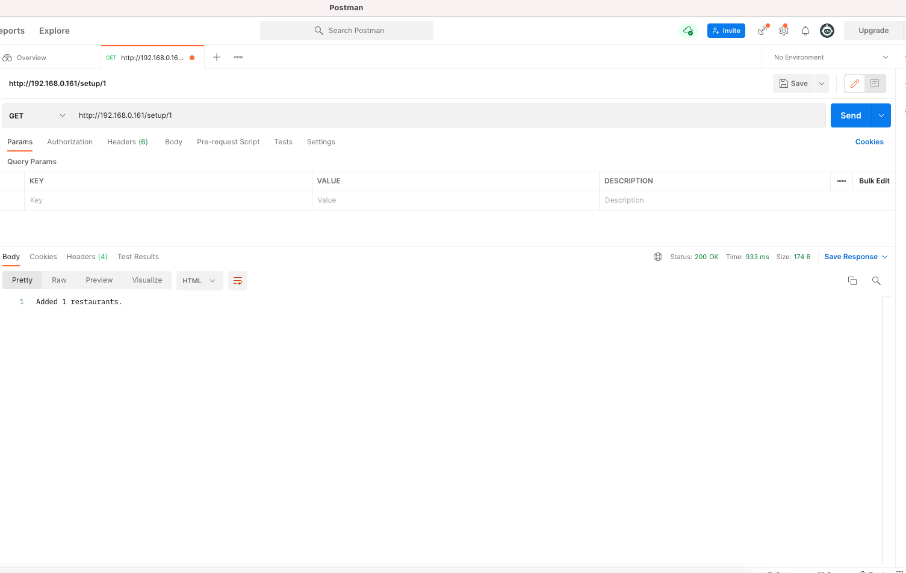
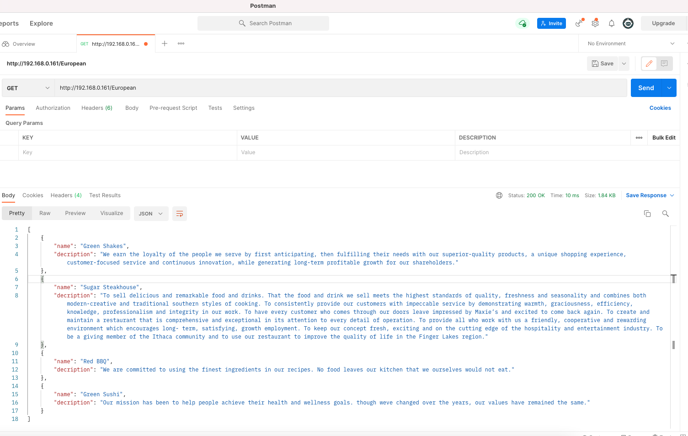

# random restaurant API 

## Endpoints:
1. `/setup/<count>`: Fetches `<count>` number of restaurants and adds them to DB.
2. `/<type>`: Fetches name and description of restaurants with type `<type>`.

## Screenshots:

